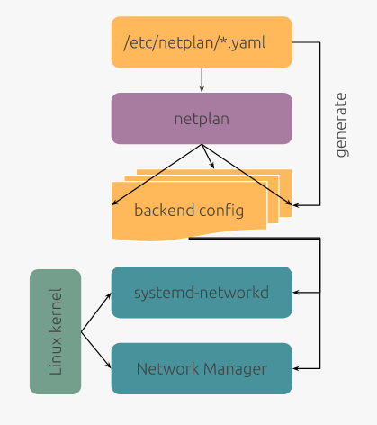

# Netplan

### The network configuration abstraction renderer

(https://netplan.io/)

Utility to easily configure network interfaces using YAML description. Netplan reads network configuration from /etc/netplan/*.yaml which are written by administrators, installers and others OS deployments. During early boot Netplan generates backend specific configuration files in /run to hand off control of devices to a particular networking daemon.

 

 
 

networkd is part of Systemd. In other word systemd-networkd used to manage network connections using Systemd. On the other hand NetworkManager is a GUI tool for configuring networking options. You can tell Netplan to use NetworkManager and it is useful for Linux desktop or laptop users.

### Examples

(https://netplan.io/examples/)

<code>

    network:
        version: 2
        renderer: NetworkManager
</code>

To let the interface named ‘enp3s0’ get an address via DHCP, create a YAML file with the following:
<code>

    network:
        version: 2
        renderer: networkd
        ethernets:
            enp3s0:
                dhcp4: true
</code>

To instead set a static IP address, use the addresses key, which takes a list of (IPv4 or IPv6), addresses along with the subnet prefix length (e.g. /24). Gateway and DNS information can be provided as well:

<code>

    network:
        version: 2
        renderer: networkd
        ethernets:
            enp3s0:
                addresses:
                    - 10.10.10.2/24
                gateway4: 10.10.10.1
                nameservers:
                    search: [mydomain, otherdomain]
                    addresses: [10.10.10.1, 1.1.1.1]
</code>

### Commands

<code>
 
    ''' Use /etc/netplan to generate the required configuration for the renderers'''
    $ netplan generate

    ''' Apply configuration and wait for user confirmation; will roll back if the newtwork is broken or no confirmation is given'''
    $ netplan try

    ''' Apply all configuration for the renderers, restarting them as necessary'''
    $ netplan apply

</code>

